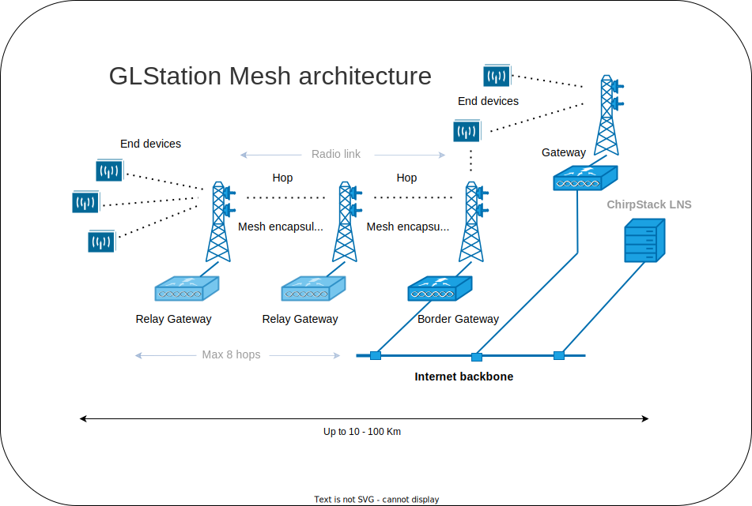

# GLStation goes to Mesh
[GLStation SX1303 - LoRaWAN Base Station](./README.md) | [GLStation hardware](./INSTALL_HARDWARE.md) | [GLStation firmware](./INSTALL_FIRMWARE.md) | [GLStation Setup](./GLStation_SETUP.md) | [GLStation Mesh](./GLStation_MESH.md)

</BR>

The chapter guides you through how to use different Mesh Gateway modes with GLStation.

GLStation has the following dynamic pre-defined Mesh modes:
- Gateway - ``default mode``
- Border Gateway
- Relay Gateway

The GLStation role in the LoRaWAN network can be easily configured by selecting one of the pre-defined gateway mode settings listed above. Switching the gateway role happens dynamically and can be done online between any modes.

</BR>

</BR>



</BR>

## ``TL;DR`` Set Gateway mode 

``Gateway`` | ``Border Gateway`` | ``Relay Gateway``
```
$ cd /home/glsbase

# Gateway
$ sudo ./set_gateway_mode.sh -g

# Border Gateway
$ sudo ./set_gateway_mode.sh -b

#Relay Gateway
$ sudo ./set_gateway_mode.sh -r
```

</BR>

## Gateway
The default mode for GLStation, where it acts as a standard gateway, routing messages between end devices and the LoRa Network Server (LNS) within its radio coverage area.

</BR>

**Set GLStation to the ``Gateway`` mode.**

```
$ cd /home/glsbase
$ sudo ./set_gateway_mode.sh -g
```

<!--
Service setup
```
$ sudo rc-service gpsd stop
$ sudo rc-service gls-gateway-mesh-relay-gw zap
$ sudo rc-update del gls-gateway-mesh-relay-gw
$ sudo rc-service gls-mqtt-forwarder-border-gw zap
$ sudo rc-update del gls-mqtt-forwarder-border-gw

$ sudo rc-update add gls-mqtt-forwarder default
```
-->

Service stack
```
gls-mqtt-forwarder
--> gls-concentratord
  --> gpsd
```

Start
```
$ sudo rc-service gls-mqtt-forwarder start 
```

gls-mqtt-forwarder service starts automatic all related and needed services.

Stop
```
$ sudo rc-service gls-mqtt-forwarder stop
```

Needed binary files: 
- ``/usr/local/bin/chirpstack-mqtt-forwarder``
- ``/usr/local/bin/chirpstack-concentratord-sx1302``

</BR>

Check configuration files.
```
$ sudo nano /etc/opt/chirpstack-mqtt-forwarder.toml

$ sudo nano /etc/opt/csx1303.toml
```

</BR>

</BR>

## Border Gateway
Functions as both a standard gateway and a relay between the Relay Gateway and LNS. Positioned at the edge of the LoRaWAN network, it forwards and receives messages via a wireless radio link, typically in areas without an Internet backbone.

</BR>

**Set GLStation to the ``Border Gateway`` mode.**

```
$ cd /home/glsbase
$ sudo ./set_gateway_mode.sh -b
```
<!--
Service setup
```
$ sudo rc-service gpsd stop
$ sudo rc-service ls-gateway-mesh-relay-gw zap
$ sudo rc-update del gls-gateway-mesh-relay-gw
$ sudo rc-service gls-mqtt-forwarder zap
$ sudo rc-update del gls-mqtt-forwarder

$ sudo rc-update add gls-mqtt-forwarder-border-gw default
$ sudo rc-update add gls-gateway-mesh-border-gw default
```
-->

Service stack
```
gls-mqtt-forwarder-border-gw
--> gls-gateway-mesh-border-gw
  --> gls-concentratord
    --> gpsd
```

Start 
```
$ sudo rc-servicegls-mqtt-forwarder-border-gw start 
```

gls-mqtt-forwarder-border-gw service starts automatic all releted and needed services.

Stop
```
$ sudo rc-service gls-gateway-mesh-border-gw stop
```

Needed binary files: 
- ``/usr/local/bin/chirpstack-mqtt-forwarder``
- ``/usr/local/bin/chirpstack-gateway-mesh``
- ``/usr/local/bin/chirpstack-concentrstord-sx1302``

</BR>

Border Gateway region setting is in the ``/etc/conf.d/gls-gateway-mesh-border-gw`` configuration file.

```
$ sudo nano /etc/conf.d/gls-gateway-mesh-border-gw
```
```
REGION_CONFIG_FILE="/etc/opt/gls/region_eu868.toml"
```

</BR>

Check the gateway mesh settings in the ``/etc/opt/gls/chirpstack-gateway-mesh.toml`` configuration file. At least all mesh gateways in the same mesh group should have a same ''signing_key'' in configuration file. 

</BR>

```
$ sudo nano /etc/opt/gls/chirpstack-gateway-mesh.toml
```
```
[mesh]
  # Signing key (AES128, HEX encoded).
  #
  # This key is used to sign and validate each mesh packet. This key must be
  # configured on every Border / Relay gateway equally.
  #
  # Generate AES128 key:
  # openssl rand -hex 16
  #signing_key="00000000000000000000000000000000"
  signing_key="21681a138f51b4bb5daec2c7552c4be0"

```

> **Note:** </BR>
> Generate a new signing _key value. 

</BR>

</BR>

## Relay Gateway
Relays messages via radio path from one relay gateway to another until they reach the Border Gateway. Supports up to 8 hops over the radio link, potentially covering distances up to 100 km if all relays are in line of sight.

</BR>

**Set GLStation to the ``Relay Gateway`` mode.**

```
$ cd /home/glsbase
$ sudo ./set_gateway_mode.sh -r
```

<!--
Service setup
```
$ sudo rc-service gpsd stop
$ sudo rc-service gls-gateway-mesh-border-gw zap
$ sudo rc-update del gls-gateway-mesh-border-gw
$ sudo rc-service  gls-mqtt-forwarder-border-gw zap
$ sudo rc-update del gls-mqtt-forwarder-border-gw
$ sudo rc-service gls-mqtt-forwarder zap
$ sudo rc-update del gls-mqtt-forwarder

$ sudo rc-update add gls-gateway-mesh-relay-gw default
```
-->

Service stack
```
gls-gateway-mesh-relay-gw
--> gls-concentratord
  --> gpsd
```

Start
```
$ sudo rc-service gls-gateway-mesh-relay-gw start 
```

gls-gateway-mesh-relay-gw service starts automatic all releted and needed services.

Stop
```
$ sudo rc-service gls-gateway-mesh-relay-gw stop
```

Needed binary files: 
- ``/usr/local/bin/chirpstack-gateway-mesh``
- ``/usr/local/bin/chirpstack-concentrstord-sx1302``

</BR>

Border Gateway region setting is in the ``/etc/conf.d/gls-gateway-mesh-relay-gw`` configuration file.

```
$ sudo nano /etc/conf.d/gls-gateway-mesh-relay-gw
```
```
REGION_CONFIG_FILE="/etc/opt/gls/region_eu868.toml"
```

</BR>

Check gateway mesh settings in ``/etc/opt/gls/chirpstack-gateway-mesh.toml`` configuration file. At least all mesh gateways in same group should have a same ''signing_key'' in configuration file. 

```
$ sudo nano /etc/opt/gls/chirpstack-mqtt-forwarder.toml
```
```
[mesh]
  # Signing key (AES128, HEX encoded).
  #
  # This key is used to sign and validate each mesh packet. This key must be
  # configured on every Border / Relay gateway equally.
  #
  # Generate AES128 key:
  # openssl rand -hex 16
  #signing_key="00000000000000000000000000000000"
  signing_key="21681a138f51b4bb5daec2c7552c4be0"

  ```

  > **Note:** </BR>
> Generate a new signing _key value. 

</BR>

</BR>

</BR>

<!--Reference material list-->
## Resources and reference material
[ChirpStack Gateway Mesh][1] 

[1]: <https://www.chirpstack.io/docs/chirpstack-gateway-mesh/index.html> "ChirpStack Gateway Mesh" 

</BR>

## GLStation guides
- [GLStation SX1303 - LoRaWAN Base Station](./README.md) guide.
- [GLStation firmware](./INSTALL_FIRMWARE.md) installation guide.
- [GLStation Setup](./GLStation_SETUP.md) guide.
- [GLStation Mesh](./GLStation_MESH.md)

</BR>
</BR>
</BR>

**Let's do IoT better**