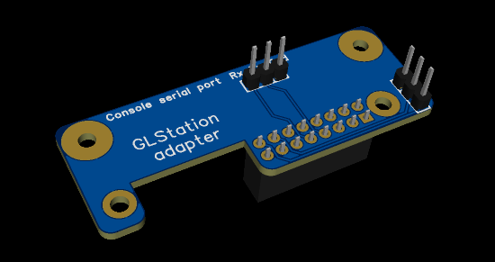

# GLStation SX1303 - Firmware installation
[GLStation SX1303 - LoRaWAN Base Station](./README.md) | [GLStation firmware](./INSTALL_FIRMWARE.md) | [GLStation Setup](./GLStation_SETUP.md)


</BR>

This document is a description how to install firmware on GLStation hardware.

GLStation is built on the Alpine linux. This guide assumes that user has a basic knowledge of the Windows and the Linux systems. Installation environment is Windows. However it's also possible to burn the firmware on Linux environment but this guide does not cover it.

</BR>

## Flashing GLStation firmware

</BR>

Equipment Preparation
- Windows 10 or 11（PC）
- USB Type-A to Type-C cable

Tools
- [RK Driver Assistant](https://files.luckfox.com/wiki/Luckfox-Pico/Software/DriverAssitant_v5.12.zip)
- [Flashing tool](https://files.luckfox.com/wiki/Luckfox-Pico/Software/SocToolKit_v1.98_20240705_01_win.zip)

Windows and Linux tools can also be downloaded from [LuckfoxTECH/luckfox-pico](https://github.com/LuckfoxTECH/luckfox-pico/tree/main/tools) GitHub.

> **Tip:** </BR> Burning firmware steps are described in [Getting Started Tutorial - Burning eMMC Images](https://wiki.luckfox.com/Luckfox-Pico/Luckfox-Pico-RV1106/Luckfox-Pico-Ultra-W/Luckfox-Pico-emmc-burn-image) guide.  
> **Please, read the guide first before you start burning firmware.**

 


### installation steps
<ol>
  <li>Download <a href="https://github.com/LouneCode/GLStation/blob/main/firmware/GLStation_firmware.zip" download>GLStation_firmware</a>.</li>
  <li>Unzip the GLStation_firmware.zip file</li>
  <li>On windows, run the flashing tool -  SocToolKit.exe</li>
  <li>Flashing tool - On Chip selection dialog / Chip support list, select <b>RV1106</b> option. </li>
  <li>Connect USB cable to the windows machine and the other end to the LuckFox Pico USB C port. At the same time hold down the LuckFox Pico BOOT button, when connect the USB C connector to the LuckFox board. Release the BOOT button, and the Rockchip flashing tool will display the MaskRom device in the USB list in the upper left corner of the application window.</li>
  <li>Flashing tool - Click the <b>Search Path...</b> button and load the firmware folder</li>
  <li>Flashing tool - Click the Download button to download firmware files to the LuckFox MCU</li>
  <li>Flashing tool - Check right side status window messages that all went well</li>
  <li>Wait about 15 seconds for the red status LED on the LuckFox board to start flashing steadily about once per second</li>
  <li>GLStation firmware is burned on the board</li>
  <li>Remove USB c connector from LuckFox Pico board</li>
  <li>Connect the ethernet cable powered PoE to LuckFox Pico ethernet connector</li>
  <li>Now on system starts networking (Ethernet, WLAN and Bluetooth connection) and system can be connected by using <b>SSH terminal</b>.</li>
</ol> 

</BR>

## User

<ul>
    <li><b>Username:</b> glsbase </li>
    <li><b>Password:</b> change-th1s-n0w!</li>
</ul> 

</BR>

> **Note:** </BR> The password **must be changed** immediately during the first GLStation session for the security reasons.

``Linux``
```
$ sudo passwd glsbase
```

</BR>

## Network

<ul> 
    <li>DHCP - GLStation uses dynamic network configuration on <b>eth0</b> and <b>wlan0</b> network interfaces. Both interfaces are on by default</li>
    <li>Bluetooth is on by default for GATT server connections</li>
    <!--li></li-->
</ul> 

</BR>

## Connect GLStation using by SSH terminal

Connect SSH terminal on the port 2210.

``Windows terminal`` ``Linux terminal``

```
ssh -p2210 glsbase@[host IP address]
```

</BR>

First have to find out IP address of the GLStation nodes. This can be a tricky task due to a dynamic IP address. On Windows or Linux terminal the scanning of the GLStations can do by using following examples: 

``Windows terminal -  PowerShell``

```
$subnet = "192.168.1"  # Replace with your subnet
$port = 2210
$timeout = 100  # Timeout in milliseconds

Write-Output "Start scanning GLStations $subnet...255"

for ($i = 1; $i -le 255; $i++) {
    $ip = "$subnet.$i"
    $socket = New-Object System.Net.Sockets.TcpClient
    $connect = $socket.BeginConnect($ip, $port, $null, $null)
    $result = $connect.AsyncWaitHandle.WaitOne($timeout, $false)
    if ($result -and $socket.Connected) {
        Write-Output "$ip found."
    }
    $socket.Close()
}

```

Scanning result includes both eth0 and wlan interfaces. The result may also includes devices other than GLStations, which uses the same port 2210.

```
Start scanning GLStations 192.168.1...255
192.168.1.101 found.
192.168.1.102 found.
192.168.1.103 found.
192.168.1.104 found.
192.168.1.105 found.
```
</BR>

``Linux terminal``

```
cat /proc/net/arp | xargs -I {} echo {}| awk '{print $1}' | xargs -I {} ping -w1 -c 1 {} 2> /dev/null | grep "1 received" -B1| grep -A1 '^--$' | grep -v '^--$'| awk '{print $2}' | xargs -I {} nc -zv -W1 {} 2210 2>&1 | grep succeeded
```
 The command sequence reads the ARP table, pings each IP address to check if it's reachable, and then checks if port 2210 is open on the reachable IP addresses. The final output will be the IP addresses where port 2210 is open and the connection succeeded.

</BR>

``GLStation Bluetooth connection browser app``

Third option is to use the experimental Bluetooth browser application to connect GLStation GATT server and find out near field GLStation nodes. Application list nodes as follows: 

```
station-001: ssh -p2210 glsbase@192.168.1.100
station-002: ssh -p2210 glsbase@192.168.1.101
station-003: ssh -p2210 glsbase@192.168.1.102
```

However, this application is still under development at the time of writing this document.

</BR>

## Connect and debug GLStation using by local serial port console

Local Serial terminal will be connected to ``UART3_TX_M1``, ``UART3_TX_M1`` and ``GND`` pins on LuckFox board. You need a  USB to Serial UART Converter module. 

Set the serial port properties: 
* Baud rate to ``115200``
* Data bits ``8``
* Stop bits ``1``
* parity ``none``
* Flow control ``none``

</BR>

> **Tip:** </BR> For example [USB to UART converter modules basis on on chip CP2102](https://www.aliexpress.com/item/32650176124.html), TTL level should be 3V3.
> </BR>
> You can use for example [``PuTTY``](https://www.putty.org/) terminal for serial port connection.

 Please, see more details on [Serial debugging instructions](https://wiki.luckfox.com/Luckfox-Pico/Luckfox-Pico-RV1106/Luckfox-Pico-Ultra-W/Luckfox-Pico-Login-UART/).

 </BR>

<figure>
    
    <figcaption><a href="https://wiki.luckfox.com/Luckfox-Pico/Luckfox-Pico-RV1106/Luckfox-Pico-Ultra-W/Luckfox-Pico-quick-start/" target="_blank">Luckfox Pico Ultra - Pin Definition</a></figcaption>
</figure>

</BR>

</BR>

GLStation adapter has a TTL 3V3 pins for serial console port.

<figure>
    
    <!--figcaption>GLStation adapter.</figcaption-->
</figure>

</BR>

## Next step - Configure GLStation
[**GLStation Setup**](./GLStation_SETUP.md) guide.

</BR>

</BR>

</BR>

<!--Reference material list-->
## Resources and reference material

* [GitHub - LuckfoxTECH/luckfox-pico][1] 
* [Luckfox Wiki][2] 
* [How to generate random MAC][3]
* [Generate a random MAC address from the Linux command line][4] 

[1]: <https://wiki.luckfox.com/Luckfox-Pico/Luckfox-Pico-RV1106/Luckfox-Pico-Ultra-W/Luckfox-Pico-quick-start> "GitHub - LuckfoxTECH/luckfox-pico" 
[2]: <https://wiki.luckfox.com/intro> "Luckfox Wiki" 

[3]: <https://en.wikipedia.org/wiki/MAC_address> "How to generatr random MAC"
[4]: <https://serverfault.com/questions/299556/how-to-generate-a-random-mac-address-from-the-linux-command-line> "Generate a random MAC address from the Linux command line"

</BR>

## GLStation guides
- [GLStation SX1303 - LoRaWAN Base Station](./README.md) guide.
- [GLStation firmware](./INSTALL_FIRMWARE.md) installation guide.
- [GLStation Setup](./GLStation_SETUP.md) guide.

</BR>
</BR>
</BR>

**Let's do IoT better**
