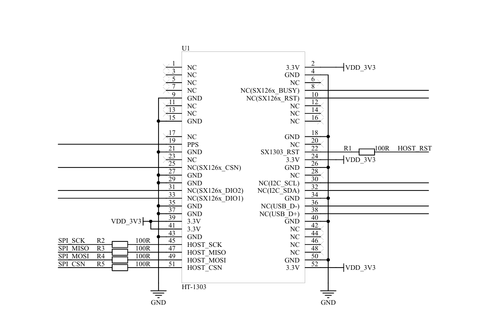

# GLStation SX1303 -  LoRaWAN Base Station
[GLStation SX1303 - LoRaWAN Base Station](./README.md) | [GLStation firmware](./INSTALL_FIRMWARE.md) | [GLStation Setup](./GLStation_SETUP.md)

 

This document is a short description of the hardware and software solutions of the GLStation SX1303 LoraWAN Base Station.

**GLStation SX1303** is a low-cost, high performance LoRaWAN base station unit with a Fine timestamping property. This unit can be used with [GLSensor tracker][7]  to resolve Lora sensor geolocation information. GLStation is a fully compatible with [ChirpStack open-source LoRaWAN Network Server][6].

 

<figure>
    
</figure>

 

Hardware 
- [Luckfox Pico Ultra W with POE][1] - ARM Cortex-A7 32-bit single-core low-cost micro Linux development board
- [LR1302 868M LoRaWAN hat][2] - An expansion board for SX1302 LoRa concentratord cards with integrated GPS module and RTC real-time clock.
- [HT1303-USB-863T870][3] - HT-1303 is a LoRa gateway module with industrial standard mini-PCI express form factor based on SX1303 + SX1250 chipset. USB interface.
- PoE 48V power adapter

Interfaces
- LoRaWAN
- Ethernet
- WLAN
- Bluetooth
- Serial console intarface

Software:
- Lightweight Alpine linux firmware for the GLStation SX1303
- [ChirpStack consentratord][4] - Customized for the GLStation SX1303 with Fine timestamp
- [ChirpStack MQTT Forwarder][5] - Customized for the GLStation SX1303
- GPSd 
- Bluetooth GATT sever 

 

GLStation receives and transmits data between LoRaWAN sensors and a LoRaWAN server. It is a similar component to a WLAN router that connects wireless WLAN devices to the LAN or internet.

 

## Hardware installation
- LR1302 868M LoRaWAN hat
- HT1303-USB-863T870
- Luckfox Pico Ultra W
- PoE power adapter
- GLStation adapter

 

### HT1303 module and LR1302 868M LoRaWAN hat

 

Start installation with the ``HT1303 concentrator module`` and the ``LR1302 868M LoRaWAN hat``. HT1303 concentrator module is installed in a mini-PCI socket on the LR1302 868M LoRaWAN hat. Attach the LoRa and GPS antennas to the correct SMA connectors. 

 

<figure>
    
    <!--figcaption><a href="https://www.elecrow.com/lr1302-868m-915m-lorawan-hat-for-rpi-sx1302-long-range-module-support-rpi-1-2-3-4-5-series.html" target="_blank">LR1302 868M LoRaWAN hat</a></figcaption-->
</figure>

 

**LR1302 868M LoRaWAN hat Pin Definitions**

<figure>
    
    <figcaption>Please, see more details in <a href="https://heltec.org/project/ht1303/" target="_blank">LR1302 868M LoRaWAN hat</a></figcaption>
</figure>

 

<figure>
    
    <figcaption><a href="https://heltec.org/project/ht1303/" target="_blank">Heltec HT1303</a></figcaption>
</figure>

 

<figure>
    
    <figcaption><a href="https://resource.heltec.cn/download/HT-1303/HT-1303_Reference_Design.pdf" target="_blank">HT1303 reference desing</a></figcaption>
</figure>

Please, see more details in [Heltec HT1303 concentrator module][3] 

 

Insert short IPEX Cable to U.FL interface of the Hat and other end to ``RFIO`` connector on the Heltec HT1303 concentrator module.

<figure>
    
    <figcaption><a href="https://heltec.org/project/ht1303/" target="_blank">IPEX cable</a></figcaption>
</figure>

<!-- 

[Heltec HT1303](https://heltec.org/project/ht1303/)
-->

 

### Luckfox Pico Ultra W PoE Kit
Attach PoE module on the Luckfox Pico Ultra board.

 

<figure>
    
    <figcaption><a href="https://www.luckfox.com/Luckfox-Pico/EN-Luckfox-Pico-Ultra" target="_blank">Luckfox Pico Ultra - POE</a></figcaption>
</figure>

 

### GLStation adapter - Connect the parts together

GLSadaptert combines the LR1302 868M LoRa HAT and Luckfox Pico Ultra W boards together. 

Adapter functions:
- Provide simple stacked construction for GLStation 
- Connects mechanically LR1302 868M LoRaWAN hat and Luckfox Pico Ultra W boards together
- Connects the serial interface of the LoRaWAN hat GPS to Luckfox Pico Ultra board
- Provides the GLStation serial console interface
 
  

<figure>
    
    <figcaption>GLStation adapter.</figcaption>
</figure>

 

GLStation adapter Schemantic

<figure>
    
    <!--figcaption>Scemantic of the adapter.</figcaption-->
</figure>

 

The header ``U1`` of the GLSadapter above is related to the header on the left side of the LuckFox Pico. See the image below.

<figure>
    
    <figcaption><a href="https://wiki.luckfox.com/Luckfox-Pico/Luckfox-Pico-RV1106/Luckfox-Pico-Ultra-W/Luckfox-Pico-quick-start/" target="_blank">Luckfox Pico Ultra - Pin Definition</a></figcaption>
</figure>

 

### Stacket construction provided by GLSadapter

<figure>
    
    <!--figcaption>GLStation</figcaption-->
</figure>

 

### Powering up Luckfox Pico Ultra and LR1302 868M LoRaWAN hat

LR1302 868M LoRaWAN hat (and HT1303 module) gets power via a USB C connector. Connect one end of the USB cable to the  Luckfox Pico Ultra ``USB A`` port and the other end to the LR1302 868M LoRaWAN hat ``USB C`` port. Luckfox Pico Ultra should be powered by **PoE**.

**Powering system**

Use PoE to power the system. Connect one end of the Ethernet cable to the PoE power adapter port and the other end to the Luckfox Pico Ultra W LAN port.

<figure>
    
    <figcaption><a href="https://www.luckfox.com/Luckfox-Pico/EN-Luckfox-Pico-Ultra" target="_blank">Luckfox Pico Ultra - POE</a></figcaption>
</figure>

 

> **Note:** 
> <UL>
> <li>When the ``USB-C`` port is powered, the USB connection will switch to the ``USB-C`` port </li>
> <li>When the ``USB-C`` port is not powered, the USB connection will switch back to the ``USB-A`` port (mainly used in  conjunction with the POE module or an external power module)</li>
> <UL>
>  

 

> **Tip:**  This LR1302 868M LoRaWAN hat + HT1303 concentrator module setup (without Luckfox pico MCU) works also in a ``Windows`` environment. Windows USB driver can be found on [HT1303 resource download page](https://resource.heltec.cn/download/HT-1303).  

 

### GLStation SX1303 closure
This part is under development...

> **Tip:** For example  [115x90x55mm Plastic Waterproof Enclosure](https://www.aliexpress.com/item/1005007327132168.html) FT115-90-55

 

## Next step - Firmware installation 

[**GLStation firmware**](./INSTALL_FIRMWARE.md) installation guide.

 

 

 

<!--Reference material list-->
## Resources and reference material

* [Luckfox Pico Ultra W with PO][1] 
* [LR1302 868M LoRaWAN hat][2] 
* [Heltec HT1303 concentrator module][3] 
* [ChirpStack concentratord][4] 
* [ChirpStack MQTT Forwarder][5] 
* [ChirpStack open-source LoRaWAN Network Server][6] 
* [GLSensor tracker demo][7] 

[1]: <https://wiki.luckfox.com/Luckfox-Pico/Luckfox-Pico-RV1106/Luckfox-Pico-Ultra-W/Luckfox-Pico-quick-start> "Luckfox Pico Ultra W with POE" 
[2]: <https://www.elecrow.com/lr1302-868m-915m-lorawan-hat-for-rpi-sx1302-long-range-module-support-rpi-1-2-3-4-5-series.html> "LR1302 868M LoRaWAN hat" 
[3]: <https://resource.heltec.cn/download/HT-1303/HT-1303(Rev.1.2).pdf> "HT1303"
[4]: <https://github.com/chirpstack/chirpstack-concentratord> "ChirpStack consentratord"
[5]: <https://github.com/chirpstack/chirpstack-mqtt-forwarder> "ChirpStack MQTT Forwarder"
[6]: <https://www.chirpstack.io/docs/index.html> "ChirpStack open-source LoRaWAN Network Server"
[7]: <https://glsensor.glsolutions.fi/gls/e89a9f76-2455-44dd-b44b-c93fa8f0c54a?q=2025> "GLSensor tracker demo"

 

## GLStation guides
- [GLStation SX1303 - LoRaWAN Base Station](./README.md) guide.
- [GLStation firmware](./INSTALL_FIRMWARE.md) installation guide.
- [GLStation Setup](./GLStation_SETUP.md) guide.

 
 
 

**Let's do IoT better**

